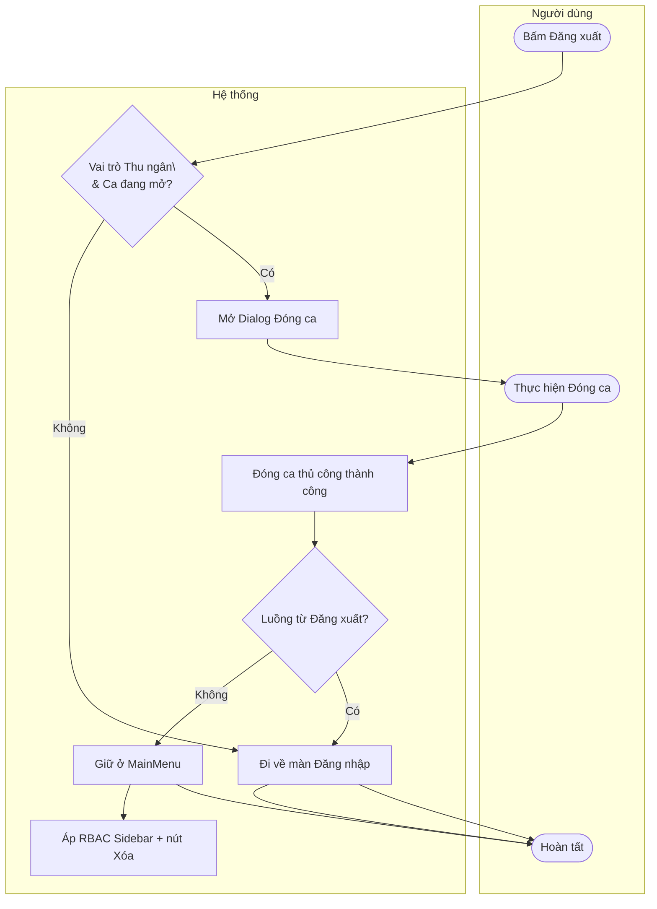

| Thành phần | Nội dung |
|:---|:---|
| **Tên Use-case** | Tối ưu đăng xuất Thu ngân và RBAC màn hình chính |
| **Mô tả Use-case** | Khi Thu ngân đăng xuất mà ca còn mở, hệ thống chuyển thẳng sang dialog Đóng ca; đóng ca thủ công không ép đăng xuất. Đồng thời ẩn module Nhân sự/Kho/Bếp trên Sidebar cho Thu ngân và giới hạn nút xóa phiếu kho theo vai trò. |
| **Actors** | Thu ngân, Quản lý, Admin |
| **Tiền điều kiện** | Người dùng đã đăng nhập; hệ thống đã nạp vai trò từ phiên hiện tại. |
| **Hậu điều kiện** | Luồng đăng xuất tuân thủ quy tắc đóng ca; menu và nút thao tác nhạy cảm hiển thị đúng RBAC. |
| **Luồng sự kiện chính** | 1. Thu ngân bấm Đăng xuất khi ca đang mở. 2. Hệ thống mở trực tiếp dialog Đóng ca. 3. Thu ngân khóa sổ thành công và hoàn tất. 4. Hệ thống chuyển về đăng nhập nếu đây là luồng đăng xuất; nếu đóng ca thủ công thì ở lại màn hình chính. 5. Sidebar ẩn Nhân sự/Kho/Bếp với Thu ngân. 6. Nút xóa phiếu nhập/xuất chỉ hiển thị cho Admin/Quản lý. |
| **Luồng sự kiện phụ** | 2a. Thu ngân hủy dialog đóng ca: phiên đăng nhập vẫn giữ nguyên. 5a. User không phải Thu ngân: Sidebar hiển thị theo quyền module hiện có. |
| **Luồng sự kiện lỗi hoặc ngoại lệ** | - Đóng ca thất bại: hiển thị lỗi từ service/procedure, không đăng xuất. - Thiếu procedure hủy phiếu xuất: hệ thống chặn thao tác và thông báo cho Quản lý DB. |

