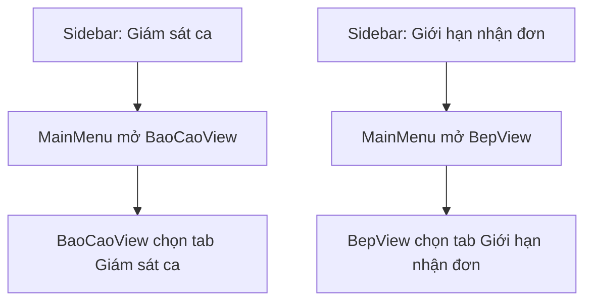

| Thành phần | Nội dung |
|:---|:---|
| **Tên Use-case** | Gộp màn hình vào Tab Báo cáo và Bếp |
| **Mô tả Use-case** | Hệ thống nhúng màn hình Giám sát ca vào Tab của Báo cáo, và nhúng màn hình Cấu hình giới hạn nhận đơn vào Tab của Bếp để giảm điều hướng rời rạc. |
| **Actors** | Quản lý, Admin, Thợ bếp (theo quyền) |
| **Tiền điều kiện** | Người dùng đã đăng nhập và có quyền truy cập chức năng tương ứng. |
| **Hậu điều kiện** | `BaoCaoView` có thêm tab Giám sát ca; `BepView` có thêm tab Giới hạn nhận đơn; menu điều hướng mở đúng tab đích. |
| **Luồng sự kiện chính** | 1. Quản lý bấm Giám sát tiền mặt từ Sidebar. 2. Hệ thống mở `BaoCaoView` và tự chọn tab Giám sát ca. 3. Quản lý bấm Giới hạn nhận đơn từ Sidebar. 4. Hệ thống mở `BepView` và tự chọn tab Giới hạn nhận đơn. |
| **Luồng sự kiện phụ** | 2a. Người dùng bấm Báo cáo kinh doanh → mở `BaoCaoView` tab Thống kê. 4a. Người dùng bấm Bếp → mở `BepView` tab Xuất kho mặc định. |
| **Luồng sự kiện lỗi hoặc ngoại lệ** | - Thiếu quyền: hệ thống chặn truy cập và hiển thị thông báo quyền hạn. - Lỗi tải FXML tab đích: hệ thống log warning và không crash UI. |

