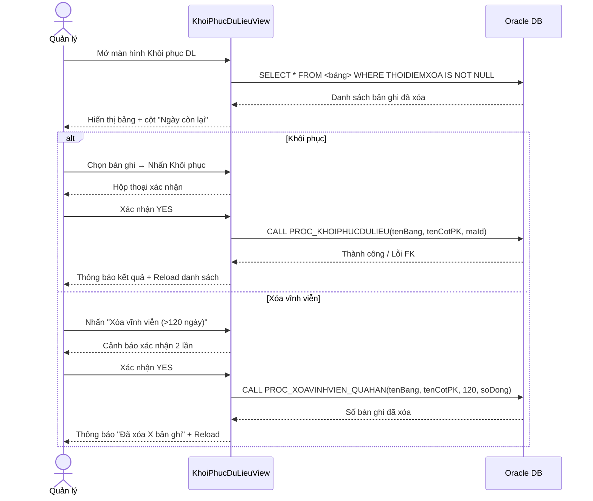

# UC60 — Khôi Phục Dữ Liệu

| Thành phần | Nội dung |
|:---|:---|
| **Tên Use-case** | Khôi phục dữ liệu đã xóa mềm |
| **Mô tả Use-case** | Cho phép Quản lý xem, lọc và khôi phục các bản ghi đã bị xóa mềm (soft-delete) trên hệ thống. Đồng thời tự động xóa vĩnh viễn các bản ghi quá 120 ngày theo yêu cầu. |
| **Actors** | Quản lý (Admin) |
| **Tiền điều kiện** | Người dùng đã đăng nhập với vai trò Quản lý. Tồn tại ít nhất một bản ghi có `THOIDIEMXOA IS NOT NULL` trong hệ thống. |
| **Hậu điều kiện** | Bản ghi được khôi phục: `THOIDIEMXOA = NULL, MaNX = NULL`. Hoặc bản ghi quá hạn bị xóa khỏi CSDL vĩnh viễn. |
| **Luồng sự kiện chính** | 1. Quản lý chọn menu "Khôi phục dữ liệu".  2. Hệ thống hiển thị danh sách bản ghi đã xóa mềm từ tất cả bảng hỗ trợ.  3. Quản lý chọn lọc theo loại đối tượng (Danh mục SP, Sản phẩm, Nguyên liệu...).  4. Quản lý chọn bản ghi cần khôi phục.  5. Hệ thống xác nhận thao tác và gọi `PROC_KHOIPHUCDULIEU`.  6. Bản ghi được kích hoạt trở lại, hệ thống thông báo thành công. |
| **Luồng sự kiện phụ** | **3a.** Quản lý nhập từ khóa vào ô tìm kiếm — hệ thống lọc client-side theo tên bản ghi.  **6a.** Quản lý nhấn "Xóa vĩnh viễn (>120 ngày)" — hệ thống xác nhận 2 lần rồi gọi `PROC_XOAVINHVIEN_QUAHAN` cho tất cả bảng, hiển thị số bản ghi đã purge. |
| **Luồng sự kiện lỗi** | **2e.** Không kết nối được CSDL → hiển thị lỗi.  **5e.** Bản ghi có ràng buộc FK → Procedure rollback, hiển thị thông báo lỗi Oracle.  **6e.** Quản lý huỷ confirm → không thực hiện. |

---

## Bảng hỗ trợ Soft-delete

| Bảng | Cột PK | Cột Tên | Loại hiển thị |
|---|---|---|---|
| DANHMUCSP | MADM | TENDM | Danh mục sản phẩm |
| SANPHAM | MASP | TENSP | Sản phẩm |
| KICHCOBANH | MAKC | TENKC | Kích cỡ bánh |
| COTBANH | MACOT | TENCOT | Cốt bánh |
| NHANBANH | MANHAN | TENNHAN | Nhân bánh |
| KIEUTRANGTRI | MATRANGTRI | TENTRANGTRI | Kiểu trang trí |
| DONVITINH | MADVT | TENDVT | Đơn vị tính |
| NGUYENLIEU | MANL | TENNL | Nguyên liệu |
| NHACUNGCAP | MANCC | TENNCC | Nhà cung cấp |
| HANGTHANHVIEN | MAHANG | TENHANG | Hạng thành viên |
| KHACHHANG | MAKH | HOTEN | Khách hàng |
| LOAITHUCHI | MALOAITHUCHI | TENLOAITHUCHI | Loại thu chi |
| PHUONGTHUCTT | MAPTTT | TENPTTT | Phương thức TT |
| VAITRO | MAVAITRO | TENVAITRO | Vai trò |

---

## Activity Diagram

---

## Stored Procedures

| Procedure | Params | Mô tả |
|---|---|---|
| `PROC_KHOIPHUCDULIEU` | `P_TENBANG, P_TENCOTXOA, P_ID` | SET THOIDIEMXOA=NULL, MaNX=NULL |
| `PROC_XOAVINHVIEN_QUAHAN` | `P_TENBANG, P_TENCOTPK, P_SO_NGAY=120, P_SO_DONG OUT` | DELETE WHERE THOIDIEMXOA <= SYSDATE - 120 |

## Quy tắc màu cột "Ngày còn lại"
- **Bình thường**: còn > 14 ngày
- **Vàng nhạt**: còn 1–14 ngày trước ngưỡng 120
- **Cam nhạt**: đã vượt 120 ngày (sẽ bị xóa khi purge)
