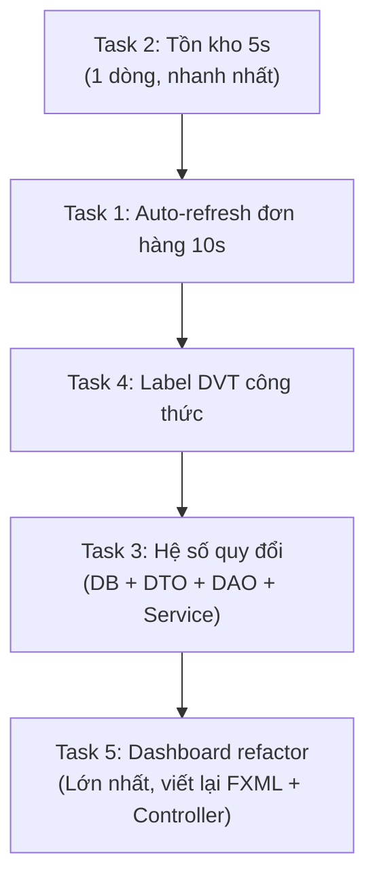

# 🔧 Implementation Plan — 5 Task Nâng cấp Hệ thống

> **Ràng buộc chính:** MVP (V→P→S→D), CẤM inline style, CẤM SQL trong Controller, tên tiếng Việt camelCase, CẤM tạo Procedure chưa xác nhận, `Timeline` cho auto-refresh, `Task`/`Platform.runLater()` cho async.

---

## Task 1: Auto-refresh đơn hàng 10s (Cả Bếp + Đơn hàng thường)

> **Scope:** `TheoDoiDonHangViewFXMLController` — thêm `Timeline` 10s refresh.
> Bếp: query đơn chưa hoàn thành. Đơn hàng thường: refresh kết quả tìm kiếm hiện tại.

### 1.1 Files sửa

| File | Thay đổi |
|---|---|
| [TheoDoiDonHangViewFXMLController.java](file:///d:/Clone/src/main/java/com/bakery/views/controllers/banhang/TheoDoiDonHangViewFXMLController.java) | Thêm `Timeline autoRefreshTimeline`, `startAutoRefresh()`, `stopAutoRefresh()`. Gọi `stopAutoRefresh()` khi scene bị destroy |
| [BepViewFXMLController.java](file:///d:/Clone/src/main/java/com/bakery/views/controllers/bep/BepViewFXMLController.java) | Thêm listener `tabPaneBep.selectionModel` → start/stop timer khi tab Đơn hàng bếp active/inactive |

### 1.2 Logic chi tiết

```java
// TheoDoiDonHangViewFXMLController
private Timeline autoRefreshTimeline;

public void startAutoRefresh() {
    if (autoRefreshTimeline != null && autoRefreshTimeline.getStatus() == RUNNING) return;
    autoRefreshTimeline = new Timeline(
        new KeyFrame(Duration.seconds(10), evt -> {
            if (bepMode) taiDonBep(); // Đơn chưa hoàn thành
            else onTimKiemDon();      // Refresh kết quả hiện tại
        })
    );
    autoRefreshTimeline.setCycleCount(INDEFINITE);
    autoRefreshTimeline.play();
}

public void stopAutoRefresh() {
    if (autoRefreshTimeline != null) autoRefreshTimeline.stop();
}
```

### 1.3 Phòng chống memory leak
- `stopAutoRefresh()` khi:
  - Tab Đơn hàng bếp bị deselect (listener trên `tabPaneBep.selectedItem`)
  - Scene bị destroy (`panelChuaDon.sceneProperty()` → null)
- `startAutoRefresh()` khi tab được chọn lại

### 1.4 Impact
- `gitnexus_impact` trước khi sửa `TheoDoiDonHangViewFXMLController` và `BepViewFXMLController`
- Blast radius: LOW (controller cục bộ, không ảnh hưởng Presenter/Service/DAO)

---

## Task 2: Auto-refresh tồn kho 5s

> **Scope:** `BaoCaoViewFXMLController` — đổi 60s → 5s.

### 2.1 Files sửa

| File | Thay đổi |
|---|---|
| [BaoCaoViewFXMLController.java](file:///d:/Clone/src/main/java/com/bakery/views/controllers/baocao/BaoCaoViewFXMLController.java) | `Duration.seconds(60)` → `Duration.seconds(5)` (dòng 157) |

### 2.2 Chi tiết
- **1 dòng thay đổi duy nhất:** `Duration.seconds(60)` → `Duration.seconds(5)`
- Cơ chế start/stop đã có sẵn (listener `tabPaneBaoCao.selectedItem` → dòng 82-92)
- **Không cần sửa gì thêm**

### 2.3 Impact
- Blast radius: LOW — chỉ ảnh hưởng frequency refresh, logic hiện tại đã xử lý async đúng cách

---

## Task 3: Hệ số quy đổi đơn vị (Unit Conversion)

> **Scope:** DB schema + DTO + DAO + Service + UI nhập kho. Đơn vị cơ bản luôn là nhỏ nhất.

### 3.1 DB Schema — ALTER TABLE + Procedure mới

| File | Thay đổi |
|---|---|
| [03_stock_recipe.sql](file:///d:/Clone/database/01_tables/03_stock_recipe.sql) | `ALTER TABLE NGUYENLIEU ADD (HESOQUYDOI NUMBER(15,4) DEFAULT 1);` |
| `database/05_procedures/` | **Procedure mới** (cần User xác nhận tên): logic quy đổi khi nhập kho |

```sql
-- ALTER thêm vào cuối file 03_stock_recipe.sql
ALTER TABLE NGUYENLIEU ADD (HESOQUYDOI NUMBER(15,4) DEFAULT 1);
```

> [!IMPORTANT]
> **Cần User xác nhận** trước khi tạo Procedure mới cho quy đổi nhập kho (Rule: CẤM tạo Procedure chưa được đồng ý).

#### Procedure đề xuất: `PROC_NHAPKHO_QUYDOI`
- Input: `P_MANL, P_SOLUONG_NHAP` (số lượng theo đơn vị nhập — VD: 1 Thùng)
- Logic: `V_SOLUONG_COSO = P_SOLUONG_NHAP * NGUYENLIEU.HESOQUYDOI`
- Ghi CTPHIEUNHAP với `V_SOLUONG_COSO` thay vì `P_SOLUONG_NHAP`

### 3.2 Java layers

| Tầng | File | Thay đổi |
|---|---|---|
| DTO | [NguyenLieuDTO.java](file:///d:/Clone/src/main/java/com/bakery/model/dto/kho/NguyenLieuDTO.java) | Thêm `private Double hesoQuydoi;` + getter/setter |
| DAO | [NguyenLieuDAO.java](file:///d:/Clone/src/main/java/com/bakery/model/dao/kho/NguyenLieuDAO.java) | Thêm `HESOQUYDOI` vào SELECT, cập nhật `mapNguyenLieu()`. Cập nhật `themNguyenLieu()` và `capNhatNguyenLieu()` |
| Service | [NguyenLieuService.java](file:///d:/Clone/src/main/java/com/bakery/services/kho/NguyenLieuService.java) | Thêm validation: `hesoQuydoi > 0` |
| View | Màn hình Nguyên liệu (FXML + Controller) | Thêm `TextField txtHesoQuydoi` cho form thêm/sửa nguyên liệu |
| View | `ThemNguyenLieuDialogController` | Thêm field `hesoQuydoi` vào dialog |

### 3.3 Logic quy đổi khi nhập kho
- Tại tầng DAO/Procedure: `soLuongThucNhap = soLuongNhap * hesoQuydoi`
- Ví dụ: Nhập 1 Thùng sữa (hesoQuydoi = 4320) → CTPHIEUNHAP.SOLUONG = 4320 ml
- Tồn kho `NGUYENLIEU.SOLUONGTONTONG` luôn tính theo đơn vị cơ bản (ml, g)

### 3.4 Impact
- `NguyenLieuDTO`: upstream nhiều — CongThucViewFXMLController, NguyenLieuPresenter, NguyenLieuService, PhieuNhapKhoDAO
- Cần chạy `gitnexus_impact` đầy đủ trước khi sửa

---

## Task 4: Hiển thị DVT bên cạnh ô Định mức (Công thức)

> **Scope:** `CongThucViewFXMLController` + FXML — thêm Label hiển thị đơn vị khi chọn nguyên liệu.

### 4.1 Files sửa

| File | Thay đổi |
|---|---|
| FXML Công thức (trong `SanPhamView.fxml` hoặc `CongThucView.fxml`) | Thêm `<Label fx:id="lblDonViTinh"/>` bên cạnh `txtDinhMuc` |
| [CongThucViewFXMLController.java](file:///d:/Clone/src/main/java/com/bakery/views/controllers/kho/CongThucViewFXMLController.java) | Thêm `@FXML Label lblDonViTinh;`, thêm `ChangeListener` trên `cmbNguyenLieu` để cập nhật label |
| [ThemCongThucDialogController.java](file:///d:/Clone/src/main/java/com/bakery/views/controllers/kho/ThemCongThucDialogController.java) | Thêm Label DVT trong dialog thêm công thức |

### 4.2 Logic

```java
// CongThucViewFXMLController — trong setupComboNguyenLieu()
cmbNguyenLieu.valueProperty().addListener((obs, oldNL, newNL) -> {
    if (newNL != null && lblDonViTinh != null) {
        lblDonViTinh.setText(newNL.getTenDVT());
    } else if (lblDonViTinh != null) {
        lblDonViTinh.setText("");
    }
});
```

### 4.3 Impact
- Blast radius: LOW — chỉ thêm Label mới, không sửa logic hiện có

---

## Task 5: Dashboard — Xóa card, thêm biểu đồ + bảng

> **Scope:** Viết lại `DashboardController` + FXML. Hiển thị biểu đồ doanh thu ngày hôm qua (chỉ xem) với animation liên tục.

### 5.1 Files sửa

| File | Thay đổi |
|---|---|
| [DashboardView.fxml](file:///d:/Clone/src/main/resources/fxml/hethong/DashboardView.fxml) | **Viết lại:** xóa 6 card điều hướng, thay bằng `LineChart` + `TableView` |
| [DashboardController.java](file:///d:/Clone/src/main/java/com/bakery/views/controllers/hethong/DashboardController.java) | **Refactor lớn:** xóa card logic, thêm chart data loading + animation |
| [ThongKeDAO.java](file:///d:/Clone/src/main/java/com/bakery/model/dao/baocao/ThongKeDAO.java) | Thêm `getThongKeTheoNgay(LocalDate)` → trả `{ngay, doanhThu, donHoanThanh, donHuy}` |
| [ThongKeService.java](file:///d:/Clone/src/main/java/com/bakery/services/baocao/ThongKeService.java) | Proxy method cho `getThongKeTheoNgay()` |
| [bakery.css](file:///d:/Clone/src/main/resources/css/bakery.css) | Thêm CSS class cho dashboard chart mới |

### 5.2 Dashboard FXML mới (cấu trúc)

```
VBox.bg-app
├── HBox (Header: banner tên user + cảnh báo tồn kho)
├── LineChart (Doanh thu ngày hôm qua — theo giờ)
│   └── Animation: fade-in các data point tuần tự
└── TableView (Chi tiết theo ngày: Ngày, Doanh thu, Đơn hoàn thành, Đơn hủy)
```

### 5.3 Chart Animation
- Sử dụng `Timeline` + `FadeTransition` / `TranslateTransition` để animate data points
- Dữ liệu: `getDoanhThu7NgayQua()` (đã có sẵn) hoặc tạo hàm mới lấy doanh thu theo giờ trong ngày hôm qua
- Animation chạy vô hạn (`INDEFINITE`): pulse/glow effect trên đường chart

### 5.4 DAO mới: `getThongKeTheoNgay()`

```sql
-- Doanh thu + số đơn hoàn thành + số đơn hủy theo ngày (7 ngày gần nhất)
SELECT
    TO_CHAR(TRUNC(D.NGAYLAP), 'DD/MM/YYYY') AS NGAY,
    NVL(SUM(H.TONGTIENTHANHTOAN), 0) AS DOANH_THU,
    COUNT(DISTINCT CASE WHEN TT.TENTRANGTHAI = 'Hoàn thành' THEN D.MADON END) AS DON_HOAN_THANH,
    COUNT(DISTINCT CASE WHEN TT.TENTRANGTHAI LIKE '%Hủy%' THEN D.MADON END) AS DON_HUY
FROM DONDATHANG D
LEFT JOIN HOADON H ON H.MADON = D.MADON
LEFT JOIN TRANGTHAIDON TT ON TT.MATRANGTHAI = D.MATRANGTHAI
WHERE D.NGAYLAP >= TRUNC(SYSDATE) - 7
GROUP BY TRUNC(D.NGAYLAP)
ORDER BY TRUNC(D.NGAYLAP)
```

### 5.5 Impact
- `DashboardController`: HIGH impact — cần `gitnexus_impact` trước khi sửa
- `ThongKeDAO`: MEDIUM — thêm hàm mới, không sửa hàm cũ
- Xóa card → navigation chỉ qua sidebar (AppShell) — đã có sẵn

---

## 📋 Thứ tự triển khai (Dependencies)



| Bước | Task | Ước lượng | Rủi ro |
|---|---|---|---|
| 1 | Task 2 — Tồn kho 5s | ⚡ 2 phút | LOW |
| 2 | Task 1 — Auto-refresh đơn hàng | 🕐 20 phút | LOW |
| 3 | Task 4 — Label DVT | 🕐 15 phút | LOW |
| 4 | Task 3 — Hệ số quy đổi | 🕐 45 phút | MEDIUM (DB schema + Procedure mới) |
| 5 | Task 5 — Dashboard refactor | 🕐 60 phút | HIGH (viết lại FXML + Controller) |

---

## ⚠️ Cần User xác nhận trước khi bắt đầu

1. **Task 3 — Procedure mới:** Đồng ý tạo Procedure `PROC_NHAPKHO_QUYDOI` (hoặc sửa Procedure nhập kho hiện có)?
2. **Task 3 — ALTER TABLE:** Đồng ý `ALTER TABLE NGUYENLIEU ADD (HESOQUYDOI NUMBER(15,4) DEFAULT 1)`?
3. **Task 5 — Xóa card:** Xác nhận xóa 6 card điều hướng, dùng sidebar (đã có sẵn AppShell)?
4. **Task 5 — DAO mới:** Đồng ý thêm `getThongKeTheoNgay()` vào `ThongKeDAO`?
